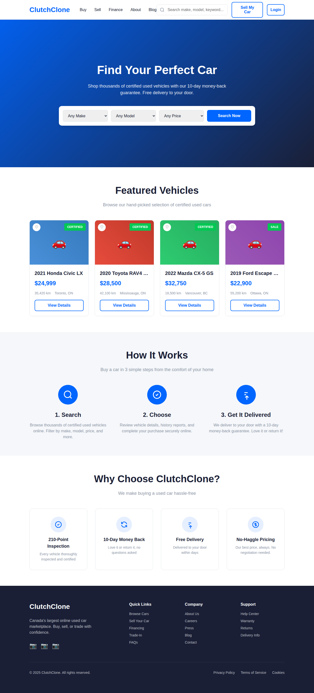

# Home & Search - Frontend Specification

**Version:** 1.0
**Date:** December 23, 2025
**Feature:** Home Page & Vehicle Search
**Platform:** Clutch Clone - Online Used Car Marketplace

---

## Overview

The Home page serves as the primary landing page for the platform, featuring a hero section with search functionality, featured vehicles, and key value propositions. The search functionality enables customers to discover vehicles through keyword search, filters, and browsing.

---

## Requirements

### REQ-HS-F-001: Hero Section Display
**Description:** Display an engaging hero section with search widget
**Priority:** High
**Type:** Functional

**Acceptance Criteria:**
- [ ] Hero section displays full-width background image with gradient overlay
- [ ] Headline text "Find Your Perfect Car" is prominently displayed
- [ ] Subheadline communicates value proposition (10-day guarantee, certified vehicles)
- [ ] Search widget is centered and easily accessible
- [ ] Hero section is responsive across all breakpoints

### REQ-HS-F-002: Quick Search Widget
**Description:** Enable users to quickly search for vehicles
**Priority:** High
**Type:** Functional

**Acceptance Criteria:**
- [ ] Make dropdown displays all available makes alphabetically
- [ ] Model dropdown is dependent on selected make
- [ ] Price range dropdown offers predefined ranges ($0-$15k, $15k-$25k, etc.)
- [ ] "Search Now" button initiates search with selected criteria
- [ ] Dropdown selections are preserved on page refresh (URL params)
- [ ] Search results open on `/browse` page with filters applied

### REQ-HS-F-003: Header Search Bar
**Description:** Provide persistent search in navigation
**Priority:** High
**Type:** Functional

**Acceptance Criteria:**
- [ ] Search bar visible in header on all pages
- [ ] Autocomplete suggestions appear after typing 2+ characters
- [ ] Suggestions include makes, models, and body types
- [ ] Recent searches displayed when input is focused (empty state)
- [ ] Search history stored in localStorage (max 10 items)
- [ ] Clear button appears when input has value
- [ ] Enter key or click submits search

### REQ-HS-F-004: Featured Vehicles Section
**Description:** Showcase hand-picked vehicles on homepage
**Priority:** Medium
**Type:** Functional

**Acceptance Criteria:**
- [ ] Display 4-8 featured vehicles in responsive grid
- [ ] Each vehicle shows: image, title, price, mileage, location
- [ ] "View Details" button links to vehicle detail page
- [ ] Favorite icon allows quick saving (requires auth)
- [ ] "View All" link navigates to full inventory
- [ ] Vehicles rotate based on inventory and promotions

### REQ-HS-F-005: How It Works Section
**Description:** Explain the buying process
**Priority:** Medium
**Type:** Functional

**Acceptance Criteria:**
- [ ] Display 3-step process: Search, Choose, Get It Delivered
- [ ] Each step has icon, title, and description
- [ ] Visual connectors between steps on desktop
- [ ] Stacks vertically on mobile
- [ ] CTA button "Start Shopping" links to browse page

### REQ-HS-F-006: Value Propositions Section
**Description:** Highlight key platform benefits
**Priority:** Medium
**Type:** Functional

**Acceptance Criteria:**
- [ ] Display key benefits: 210-Point Inspection, 10-Day Guarantee, Free Delivery, No Haggle Pricing
- [ ] Each benefit has icon and brief description
- [ ] Links to relevant information pages
- [ ] Responsive 4-column to 2-column to 1-column layout

### REQ-HS-F-007: Testimonials Section
**Description:** Display customer reviews
**Priority:** Low
**Type:** Functional

**Acceptance Criteria:**
- [ ] Carousel of customer testimonials
- [ ] Each testimonial shows: quote, customer name, vehicle purchased
- [ ] Star rating displayed
- [ ] Navigation dots/arrows for carousel
- [ ] Auto-rotate with pause on hover

---

## UI Components

### Hero Section

```
Dimensions:
- Height: 600px (desktop), 480px (mobile)
- Width: 100%
- Background: Gradient overlay on image

Layout:
┌─────────────────────────────────────────────────────────────────┐
│                                                                   │
│                    [Background Image + Gradient]                  │
│                                                                   │
│         ┌────────────────────────────────────────┐              │
│         │  Find Your Perfect Car                 │              │
│         │  (H1, 48px, White, Bold)              │              │
│         │                                        │              │
│         │  Shop thousands of certified used      │              │
│         │  vehicles with 10-day guarantee        │              │
│         │  (18px, White 90% opacity)            │              │
│         │                                        │              │
│         │  ┌────────────────────────────────┐  │              │
│         │  │ [Make] [Model] [Price] [Search]│  │              │
│         │  └────────────────────────────────┘  │              │
│         │                                        │              │
│         └────────────────────────────────────────┘              │
│                                                                   │
└─────────────────────────────────────────────────────────────────┘

Gradient: linear-gradient(135deg, rgba(0, 102, 255, 0.85) 0%, rgba(26, 31, 54, 0.75) 100%)
```

### Search Widget

```
Container:
- Width: 800px (desktop), 100% - 32px (mobile)
- Height: 80px (desktop), auto (mobile - stacked)
- Background: #FFFFFF
- Border-radius: 12px
- Box-shadow: 0 10px 15px -3px rgba(0, 0, 0, 0.1)
- Padding: 16px

Dropdowns (Desktop):
- Width: 180px each
- Height: 48px
- Border: 1px solid #E1E4E8
- Border-radius: 8px
- Gap: 12px

Search Button:
- Width: 180px
- Height: 48px
- Background: #0066FF
- Color: #FFFFFF
- Border-radius: 8px
- Font: 16px, Weight 600
```

### Header Search Bar

```
Dimensions:
- Width: 320px (desktop)
- Height: 44px

Styling:
- Border: 1px solid #E1E4E8
- Border-radius: 8px
- Padding: 12px 16px 12px 44px

Elements:
- Search icon: 20x20, left 12px, color #8B95A5
- Input placeholder: "Search make, model, keyword..."
- Clear button: 16x16, right 12px (visible when has value)
```

### Autocomplete Dropdown

```
Position: Absolute, below search bar
Width: 320px (matches input)
Max-height: 400px
Background: #FFFFFF
Border: 1px solid #E1E4E8
Border-radius: 8px
Box-shadow: Level 2

Item:
- Height: 48px
- Padding: 12px 16px
- Icon: 20x20 (search or clock for history)
- Primary text: Make/Model name
- Secondary text: Result count (right-aligned, #8B95A5)
- Hover: Background #F5F7FA
- Active/Selected: Background #E6F0FF
```

### Featured Vehicle Card

```
Width: Fluid (25% - gap on desktop, 50% tablet, 100% mobile)
Background: #FFFFFF
Border: 1px solid #E1E4E8
Border-radius: 12px

Structure:
┌────────────────────────────────┐
│ ┌────────────────────────────┐ │
│ │                            │ │
│ │     Vehicle Image          │ │ ← 4:3 aspect ratio
│ │        (4:3)               │ │   Border-radius: 12px 12px 0 0
│ │                            │ │
│ │  [CERTIFIED]         [♡]   │ │ ← Badge top-right, Favorite icon
│ └────────────────────────────┘ │
│ Padding: 20px                  │
│                                │
│ 2021 Honda Civic LX            │ ← 20px, Bold, #1A1F36
│                                │
│ $24,999                        │ ← 24px, Bold, #0066FF
│                                │
│ 🚗 35,420 km  📍 Toronto       │ ← 14px, #8B95A5
│                                │
│ ┌────────────────────────────┐ │
│ │      View Details          │ │ ← Secondary button
│ └────────────────────────────┘ │
└────────────────────────────────┘

Hover:
- Transform: translateY(-4px)
- Box-shadow: Level 2
- Border: 1px solid #0066FF
```

---

## State Management

### Search State

```typescript
interface HomeSearchState {
  // Quick Search Widget
  selectedMake: string | null;
  selectedModel: string | null;
  selectedPriceRange: string | null;

  // Header Search
  searchQuery: string;
  suggestions: SearchSuggestion[];
  recentSearches: string[];
  isAutocompleteOpen: boolean;
  highlightedIndex: number;

  // Featured Vehicles
  featuredVehicles: Vehicle[];
  isFeaturedLoading: boolean;

  // UI State
  isSearching: boolean;
}

interface SearchSuggestion {
  type: 'make' | 'model' | 'bodyType' | 'recent';
  text: string;
  count?: number;
  icon?: string;
}

interface Vehicle {
  id: string;
  make: string;
  model: string;
  year: number;
  price: number;
  mileage: number;
  location: string;
  primaryImage: string;
  isCertified: boolean;
  isFavorite: boolean;
}
```

### Actions

```typescript
// Search Actions
setSelectedMake(make: string | null): void;
setSelectedModel(model: string | null): void;
setSelectedPriceRange(range: string | null): void;
setSearchQuery(query: string): void;
submitQuickSearch(): void;
submitHeaderSearch(query: string): void;

// Autocomplete Actions
fetchSuggestions(query: string): Promise<void>;
selectSuggestion(suggestion: SearchSuggestion): void;
clearSuggestions(): void;
navigateSuggestions(direction: 'up' | 'down'): void;

// Recent Searches
addRecentSearch(query: string): void;
clearRecentSearches(): void;

// Favorites
toggleFavorite(vehicleId: string): void;
```

---

## API Integration

### Endpoints

```
GET /api/v1/vehicles/makes
Response: { makes: [{ name: string, count: number }] }

GET /api/v1/vehicles/models?make={make}
Response: { models: [{ name: string, count: number }] }

GET /api/v1/vehicles/suggestions?q={query}
Response: {
  suggestions: [
    { type: 'make', text: 'Honda', count: 234 },
    { type: 'model', text: 'Honda Civic', count: 89 }
  ]
}

GET /api/v1/vehicles/featured
Response: { vehicles: Vehicle[] }

GET /api/v1/content/homepage
Response: {
  hero: { title, subtitle, backgroundImage },
  howItWorks: Step[],
  valueProps: ValueProp[],
  testimonials: Testimonial[]
}
```

---

## Events Emitted

| Event Name | Trigger | Data |
|------------|---------|------|
| `UserSearched` | Quick search or header search submitted | `{ query, filters, userId, timestamp }` |
| `SearchResultsDisplayed` | Results page loads | `{ searchId, resultCount, filters }` |
| `VehicleViewed` | Featured vehicle clicked | `{ vehicleId, source: 'featured', userId }` |
| `FavoriteAdded` | Heart icon clicked (to favorite) | `{ vehicleId, userId }` |
| `FavoriteRemoved` | Heart icon clicked (to unfavorite) | `{ vehicleId, userId }` |

---

## Responsive Behavior

### Desktop (1440px+)
- Hero: 600px height, search widget 800px wide inline
- Featured: 4-column grid
- How It Works: 3 columns with connectors
- Value Props: 4 columns

### Tablet (768px - 1439px)
- Hero: 500px height, search widget full-width
- Featured: 2-column grid
- How It Works: 3 columns, no connectors
- Value Props: 2 columns

### Mobile (< 768px)
- Hero: 480px height, search dropdowns stacked
- Featured: 1-column, horizontal scroll optional
- How It Works: Single column, vertical
- Value Props: Single column

---

## Accessibility

- Hero heading is H1 (only one per page)
- Search inputs have proper labels (visually hidden if needed)
- Autocomplete uses ARIA combobox pattern
- Featured vehicles are article elements
- Keyboard navigation for autocomplete (arrow keys, enter, escape)
- Focus management when autocomplete opens/closes
- Skip link to main content

---

## Performance

- Hero image: WebP with lazy loading, multiple sizes (srcset)
- Featured vehicles: Skeleton loaders while fetching
- Autocomplete: Debounce input (300ms)
- Suggestions: Cache in memory for session
- Critical CSS: Inline hero styles
- Font preloading for headline fonts

---

## Mockup



*See mockup-home.html for interactive prototype*
