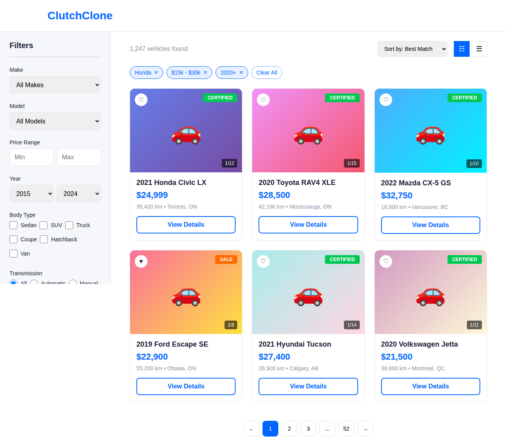

# Vehicle Listings - Frontend Specification

**Version:** 1.0
**Date:** December 23, 2025
**Feature:** Vehicle Browse & Listings
**Platform:** Clutch Clone - Online Used Car Marketplace

---

## Overview

The Vehicle Listings feature provides the primary browsing experience where customers can explore the inventory, apply filters, sort results, and discover vehicles. This is the main discovery interface after the homepage search.

---

## Requirements

### REQ-VL-F-001: Vehicle Grid Display
**Description:** Display vehicles in a responsive grid layout
**Priority:** High
**Type:** Functional

**Acceptance Criteria:**
- [ ] Vehicles displayed in 3-column grid (desktop), 2-column (tablet), 1-column (mobile)
- [ ] Each card shows: image, title, price, mileage, location
- [ ] Lazy loading of images below the fold
- [ ] Skeleton loaders while content loads
- [ ] Empty state when no results match filters

### REQ-VL-F-002: Filter Sidebar
**Description:** Enable comprehensive filtering of vehicle inventory
**Priority:** High
**Type:** Functional

**Acceptance Criteria:**
- [ ] Filter by: Make, Model, Price Range, Year, Mileage, Body Type, Transmission, Fuel Type, Color
- [ ] Make/Model dropdowns are dependent (model changes based on make)
- [ ] Price and mileage use dual-handle sliders
- [ ] Filters apply immediately or via "Apply" button (configurable)
- [ ] Active filters shown as removable chips above results
- [ ] Filter state persisted in URL for shareability
- [ ] Mobile: Filters in bottom sheet modal

### REQ-VL-F-003: Sort Functionality
**Description:** Allow sorting of search results
**Priority:** High
**Type:** Functional

**Acceptance Criteria:**
- [ ] Sort options: Best Match, Price Low-High, Price High-Low, Mileage Low-High, Year New-Old, Recently Added
- [ ] Selected sort option persisted across pagination
- [ ] Sort visible in results header

### REQ-VL-F-004: Pagination
**Description:** Navigate through pages of results
**Priority:** Medium
**Type:** Functional

**Acceptance Criteria:**
- [ ] Show 24 vehicles per page (configurable)
- [ ] Page numbers with ellipsis for large result sets
- [ ] Previous/Next buttons
- [ ] Scroll to top on page change
- [ ] "Showing X of Y results" indicator
- [ ] Mobile option: Infinite scroll or "Load More" button

### REQ-VL-F-005: View Toggle
**Description:** Switch between grid and list view
**Priority:** Low
**Type:** Functional

**Acceptance Criteria:**
- [ ] Grid view (default): Card layout with image prominently
- [ ] List view: Horizontal cards with more details visible
- [ ] View preference saved to localStorage
- [ ] Smooth transition between views

### REQ-VL-F-006: Save to Favorites
**Description:** Allow users to save vehicles to favorites
**Priority:** Medium
**Type:** Functional

**Acceptance Criteria:**
- [ ] Heart icon on each vehicle card
- [ ] Click toggles favorite status
- [ ] Visual feedback on toggle (filled/unfilled heart)
- [ ] Guest users prompted to sign in
- [ ] Favorite count visible in header (if logged in)

---

## UI Components

### Results Header

```
Layout: Flex, space-between
Height: 48px
Margin-bottom: 24px

Structure:
┌─────────────────────────────────────────────────────────────┐
│  1,247 vehicles found        Sort by: [Best Match ▼] [Grid][List] │
│  (16px, #8B95A5)            (dropdown)              (icons)        │
└─────────────────────────────────────────────────────────────┘
```

### Filter Sidebar (Desktop)

```
Width: 280px
Position: Sticky, top 104px (80px header + 24px padding)
Background: #F5F7FA
Border-right: 1px solid #E1E4E8
Padding: 24px
Max-height: calc(100vh - 104px)
Overflow-y: auto

Filter Groups:
┌──────────────────────────────┐
│  Filters             [Clear] │
│  ─────────────────────────── │
│                              │
│  Make                        │
│  [All Makes            ▼]    │
│                              │
│  Model                       │
│  [All Models           ▼]    │
│                              │
│  Price Range                 │
│  $0 ──●────────────●── $100k │
│  [Min]              [Max]    │
│                              │
│  Year                        │
│  [2015 ▼] - [2024 ▼]         │
│                              │
│  Mileage                     │
│  0 ──────────────●── 200k km │
│                              │
│  Body Type                   │
│  ☐ Sedan    ☐ SUV           │
│  ☐ Truck    ☐ Coupe          │
│  ☐ Hatchback ☐ Van           │
│                              │
│  Transmission                │
│  ○ All ○ Auto ○ Manual       │
│                              │
│  Fuel Type                   │
│  ☐ Gas ☐ Diesel              │
│  ☐ Hybrid ☐ Electric         │
│                              │
│  [    Apply Filters    ]     │
│                              │
└──────────────────────────────┘
```

### Active Filter Chips

```
Location: Above results grid
Layout: Flex wrap with 8px gap

Chip Style:
- Height: 32px
- Padding: 8px 12px
- Background: #E6F0FF
- Border: 1px solid #0066FF
- Border-radius: 16px
- Font: 14px, #0066FF

Example:
[Honda ×] [2020-2024 ×] [$15k-$30k ×] [Clear All]
```

### Vehicle Card (Grid View)

```
Width: Calc((100% - 48px) / 3)
Background: #FFFFFF
Border: 1px solid #E1E4E8
Border-radius: 12px

Structure:
┌────────────────────────────────────┐
│ ┌────────────────────────────────┐ │
│ │        Vehicle Image           │ │
│ │           (4:3)                │ │
│ │  [♡]                [CERTIFIED]│ │
│ │                     [1/12]     │ │
│ └────────────────────────────────┘ │
│  Padding: 16px                     │
│                                    │
│  2021 Honda Civic LX               │
│  (18px, Bold, max 1 line)          │
│                                    │
│  $24,999                           │
│  (22px, Bold, #0066FF)             │
│                                    │
│  35,420 km • Toronto, ON           │
│  (14px, #8B95A5)                   │
│                                    │
│  [    View Details    ]            │
└────────────────────────────────────┘
```

### Vehicle Card (List View)

```
Width: 100%
Height: 180px
Background: #FFFFFF
Border: 1px solid #E1E4E8
Border-radius: 12px

Structure:
┌─────────────────────────────────────────────────────────────────┐
│ ┌────────────┐                                                   │
│ │            │  2021 Honda Civic LX             [♡]             │
│ │  Vehicle   │  (20px, Bold)                                     │
│ │   Image    │                                                   │
│ │   (4:3)    │  35,420 km • Automatic • Gasoline • Toronto, ON  │
│ │            │  (14px, #8B95A5)                                  │
│ │ [CERTIFIED]│                                                   │
│ │            │  $24,999              [View Details]              │
│ └────────────┘  (24px, Bold, #0066FF)                            │
└─────────────────────────────────────────────────────────────────┘
```

### Pagination

```
Layout: Centered, flex
Gap: 8px

Structure:
[←] [1] [2] [3] ... [52] [→]

Button Style:
- Size: 40px × 40px
- Border: 1px solid #E1E4E8
- Border-radius: 8px
- Active: Background #0066FF, Color white
```

### Filter Bottom Sheet (Mobile)

```
Trigger: "Filters (3)" button fixed at bottom
Animation: Slide up, 300ms ease

Structure:
┌───────────────────────────────────┐
│  ══════  (drag handle)             │
│                                    │
│  Filters              [Reset] [×]  │
│  3 active                          │
│  ─────────────────────────────     │
│                                    │
│  [Collapsible Accordion Sections]  │
│  ▼ Make & Model                    │
│  ▼ Price Range                     │
│  ▼ Year                            │
│  ▼ Mileage                         │
│  ▼ Body Type                       │
│  ▼ Transmission                    │
│  ▼ Fuel Type                       │
│                                    │
│  ┌───────────────────────────────┐ │
│  │   Show 1,247 Results          │ │ ← Sticky bottom
│  └───────────────────────────────┘ │
└───────────────────────────────────┘
```

---

## Page Routes

| Route | Description |
|-------|-------------|
| `/browse` | All vehicles, no filters |
| `/browse?make=honda` | Filtered by make |
| `/browse?make=honda&model=civic` | Filtered by make+model |
| `/browse?priceMin=15000&priceMax=30000` | Filtered by price |
| `/browse?sort=price_asc&page=2` | Sorted and paginated |

---

## State Management

```typescript
interface ListingsState {
  // Results
  vehicles: VehicleSummary[];
  totalCount: number;
  isLoading: boolean;
  error: string | null;

  // Filters
  filters: {
    makes: string[];
    models: string[];
    priceMin: number | null;
    priceMax: number | null;
    yearMin: number | null;
    yearMax: number | null;
    mileageMax: number | null;
    bodyTypes: string[];
    transmission: 'all' | 'automatic' | 'manual';
    fuelTypes: string[];
    colors: string[];
  };

  // Sorting & Pagination
  sort: SortOption;
  page: number;
  pageSize: number;
  totalPages: number;

  // UI
  view: 'grid' | 'list';
  isFilterPanelOpen: boolean;

  // Facets (for filter counts)
  facets: {
    makes: FacetItem[];
    models: FacetItem[];
    bodyTypes: FacetItem[];
    priceRanges: RangeFacet[];
    yearRanges: RangeFacet[];
  };
}

interface VehicleSummary {
  id: string;
  make: string;
  model: string;
  year: number;
  trim: string;
  price: number;
  mileage: number;
  location: { city: string; province: string };
  primaryImage: string;
  imageCount: number;
  badges: string[];
  isFavorite: boolean;
  transmission: string;
  fuelType: string;
}
```

---

## Events Emitted

| Event | Trigger | Data |
|-------|---------|------|
| `FilterApplied` | Filter changed | `{ filterType, filterValue, resultCount }` |
| `FilterRemoved` | Filter chip removed | `{ filterType, filterValue }` |
| `SearchResultsDisplayed` | Results loaded | `{ searchId, resultCount, page }` |
| `VehicleViewed` | Card clicked | `{ vehicleId, position, source }` |
| `FavoriteAdded` | Heart clicked (add) | `{ vehicleId }` |
| `FavoriteRemoved` | Heart clicked (remove) | `{ vehicleId }` |
| `SortChanged` | Sort dropdown changed | `{ sortOption }` |
| `PaginationClicked` | Page number clicked | `{ page }` |

---

## Accessibility

- Filter groups use fieldset/legend
- Sliders are keyboard accessible (arrow keys)
- Vehicle cards are article elements
- "X results found" announced via live region on filter change
- Focus management when filter panel opens/closes
- Clear filter actions have visible focus states

---

## Performance

- Virtual scrolling for 100+ results
- Debounce filter changes (300ms)
- Prefetch next page on scroll near bottom
- Image lazy loading with IntersectionObserver
- Skeleton loaders match card dimensions

---

## Mockup



*See mockup-listings.html for interactive prototype*
